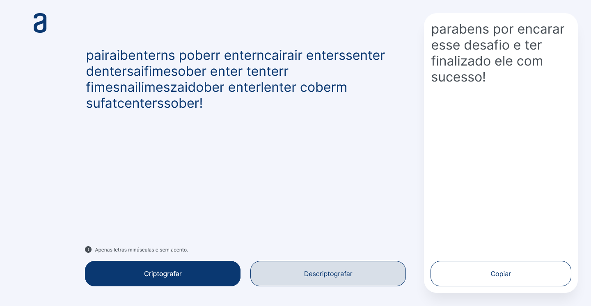

# 🔐 Decodificador de texto

## 📖 Descrição

Criptografador e descriptografador simples de texto, feito com *HTML*, *CSS* e *Javascript*, desenvolvido durante a formação **Oracle Next Education** em parceria com a Alura.

## 💡 Como o projeto funciona

O usuário digita o texto a ser criptografado/descriptografado, o sistema realiza as substituições necessárias e retorna o conteúdo com as devidas conversões.

### Tabela de conversão

| Vogal | Conversão |
| ----- | --------- |
| *"e"* | *"enter"* |
| *"i"* | *"imes"*  |
| *"a"* | *"ai"*    |
| *"o"* | *"ober"*  |
| *"u"* | *"ufat"*  |

A criptografia é feita com a substituição das vogais, na ordem acima, pelas palavras à direita.

A descriptografia funciona de maneira semelhante, substituindo as partes criptografadas de volta para suas respectivas vogais.

## 🔨 Ferramentas e Tecnologias

  
  
  
  
  
  
  

## 🖼️ Imagem do site

Veja como o site ficou, ao vivo, [clicando aqui](https://gracilianoog.github.io/descodificador-de-texto/).

**Imagem da página inicial**

**Imagem da página com conteúdo**

## 📆 Possíveis atualizações futuras

    ✔️ Tornar o site responsivo para diferentes plataformas;
    ✔️ Organizar os arquivos e diretórios;
    ✔️ Melhorar o readme, adicionar imagens;
    ✔️ Alterar o favicon;
    ✔️ Melhorar a usabilidade;
    ✔️ Melhorar o suporte para outros navegadores;
    ✔️ Revisão geral do código.

## 📌 Mais informações

Este projeto foi feito com base no *Challenge da Alura* em *parceria com a Oracle*, do projeto **Oracle Next Education**.

Caso encontre algum problema, pode me avisar. Toda e qualquer crítica será sempre bem-vinda!

## 🔗 Links

* [🔍 Alura](https://www.alura.com.br/)
* [🔍 Oracle Next Education](https://www.oracle.com/br/education/oracle-next-education/)
* [🔍 Projeto | Figma](https://www.figma.com/file/QyfH9nA4OJwHQJeiidhHzV/Alura-Challenge---Desafio-1---L%C3%B3gica---Pessoal?node-id=0%3A1)
* [🔍 Javascript Events | W3Schools](https://www.w3schools.com/jsref/dom_obj_event.asp)
* [🔍 setTimeout | MDN](https://developer.mozilla.org/en-US/docs/Web/API/setTimeout)
* [🔍 animate | MDN](https://developer.mozilla.org/en-US/docs/Web/API/Element/animate)
* [🔍 Keyframe Formats | MDN](https://developer.mozilla.org/en-US/docs/Web/API/Web_Animations_API/Keyframe_Formats)