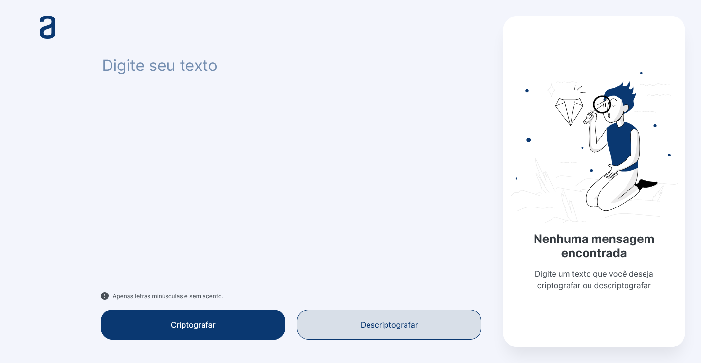

# 🔐 Decodificador de texto

## 📖 Descrição

Criptografador e descriptografador simples de texto, desenvolvido com HTML, CSS e Javascript, desenvolvido durante a formação Oracle Next Education em parceria com a Alura.

## 💡 Como o projeto funciona

O usuário digita o texto a ser criptografado/descriptografado, o sistema realiza as substituições necessárias e retorna o conteúdo com as devidas conversões.

* A letra *"e"* é convertida para *"enter"*
* A letra *"i"* é convertida para *"imes"*
* A letra *"a"* é convertida para *"ai"*
* A letra *"o"* é convertida para *"ober"*
* A letra *"u"* é convertida para *"ufat"*

A criptografia é feita com a substituição das vogais, na ordem acima, pelas palavras à direita.

A descriptografia funciona de maneira semelhante, substituindo as partes criptografadas de volta para suas respectivas vogais.

## 🔨 Ferramentas e Tecnologias

* **Trello**
  * Gerenciamento das etapas do projeto
* **Figma**
  * Design conceitual do projeto
* **VSCode**
  * Desenvolvimento do código e organização dos arquivos
* **Git**
  * Versionamento do código
* **Github**
  * Hospedagem dos arquivos

## 🖼️ Imagem do site

Veja como o site ficou, ao vivo, [clicando aqui](https://gracilianoog.github.io/descodificador-de-texto/).

**Imagem da página inicial**

**Imagem da página com conteúdo**

## 📆 Possíveis atualizações futuras

    ✔️ Tornar o site responsivo para diferentes plataformas;
    ✔️ Organizar os arquivos e diretórios;
    ✔️ Melhorar o readme, adicionar imagens;
    ✔️ Alterar o favicon;
    ✔️ Melhorar a usabilidade;
    ✔️ Melhorar o suporte para outros navegadores;
    ✔️ Revisão geral do código.

## 📌 Mais informações

Este projeto foi feito com base no *Challenge da Alura* em *parceria com a Oracle*, do projeto **Oracle Next Education**.

Toda e qualquer crítica será sempre bem-vinda!

## 🔗 Links

* [🔍 Alura](https://www.alura.com.br/)
* [🔍 Oracle Next Education](https://www.oracle.com/br/education/oracle-next-education/)
* [🔍 Projeto | Figma](https://www.figma.com/file/QyfH9nA4OJwHQJeiidhHzV/Alura-Challenge---Desafio-1---L%C3%B3gica---Pessoal?node-id=0%3A1)
* [🔍 Javascript Events | W3Schools](https://www.w3schools.com/jsref/dom_obj_event.asp)
* [🔍 setInterval | MDN](https://developer.mozilla.org/en-US/docs/Web/API/setTimeout)
* [🔍 animate | MDN](https://developer.mozilla.org/en-US/docs/Web/API/Element/animate)
* [🔍 Keyframe Formats | MDN](https://developer.mozilla.org/en-US/docs/Web/API/Web_Animations_API/Keyframe_Formats)